f
# COMP2150  - Level Design Document
### Name: [Swami Hipolito]
### Student number: [48159042] 

## 1. Player Experience (~700 words)

### 1.1. Discovery
As mentioned by Costello and Edmond, "Discovery is the pleasure participants get from making a discovery or working something out."(Costello and Edmonds, 2007). In this level, discovery arises from the player's natural curiosity to comprehend the game's mechanics, limitations, and interactions with each other in the game world. 
As the player learns the basic mechanics such as movement they quickly begin to uncover characters' running speed, jumping height, and the combined effects of utilising multiple mechanics simultaneously. Discovery can include finding different uses of game elements such as moving an object somewhere unconventional in order to boost jumping height or distance. This can create shortcuts/speedruns or lead to finding an exit out of the game world. Finding out ways around a system or defying its rules is discovery and it brings pleasure to the player when they achieve it. When grabbing the third key in this level it may look like the player can jump over the acid pool, attempting to jump over it to access the next part of the level showcases the player's sense of discovery and their desire to push boundaries. 

### 1.2. Drama
Drama is a target experience able to invoke feelings such as fear, tension, relief and hope. The level's dramatic act starts low as the intensity is not too high, nothing is at stake yet. As the player learns the basic mechanics they start feeling confident and look forward to continuing exploring. The intensity escalates into the hook as the player comes in contact with the staff and is able to use it to acquire a key. This action empowers the players, igniting curiosity about future applications of the item. Some platforms are used in this level as connective space, the platform gives the player time to take a breath and offer opportunities to create resonance.

Moments of high intensity include grabbing the third key as the key stands on top of acid and the moments before moving the last platform. The anticipation before shooting the last switch, unsure of the outcome, creates the climax of the dramatic arc.Once the player is half way through the glowing cave the tension drops bringing the dramatic arc to a close. 

### 1.3. Challenge
Challenge can be explained as "the pleasure participants get from having to develop a skill or to exercise skill in order to do something."(Costello and Edmonds, 2007). In this level, ensuring multiple challenges were given to the player was a must to have a fun and engaging experience. 
Challenge can vary depending on the player's current understanding of the game's mechanics and concepts. As players progress through the level, challenges evolve in complexity and demand a greater understanding of game mechanics. The challenge begins with physical challenges such as basic movement, players are then tested with jumping over objects or onto other platforms in order to progress. 

In addition to physical challenges, players also encounter mental challenges that require problem-solving skills to progress. These include unlocking doors through puzzles or strategizing encounters to defeat enemies more effectively.

The main goal of this level is to introduce players to new mechanics gradually, ensuring they have a solid understanding before increasing the challenge. This prevents frustration and makes sure players feel empowered to tackle increasingly difficult obstacles. In this level, players are initially challenged with their ability to jump between platforms, followed by the task of acquiring a key using a staff to break through columns. Additional challenges in the level include navigating moving platforms, avoiding hazards like acid and spikes, fighting enemies, utilising movement techniques to avoid spitter attacks, and learning to jump and shoot simultaneously to trigger switches.

### 1.4. Exploration
Edmonds and Costello define exploration as "the pleasure participants get from exploring a situation."(Costello and Edmonds, 2007). In this level, players quickly grasp the plot and become excited to explore the world. The level is divided into three distinct parts, each with its own design, atmosphere, and challenges. This separation breaks up gameplay into different chunks that add depth to the exploration experience.
To minimise backtracking the level was built in a linear form in an attempt to keep the experience fresh, ensuring players remain engaged in their exploration.

The level transitions from an outdoor area used to introduce the plot, to caves with different atmospheres, the first one resembling a typical cave and another with a mystical, blue aura.
The final part takes players through a glowing forest, evoking wonder and providing a  space for reflection on their experience.

## 2. Core Gameplay (~400 words)

### 2.1. Passthrough Platforms
Passthrough platforms are introduced early on as it is an essential core mechanic for the level.
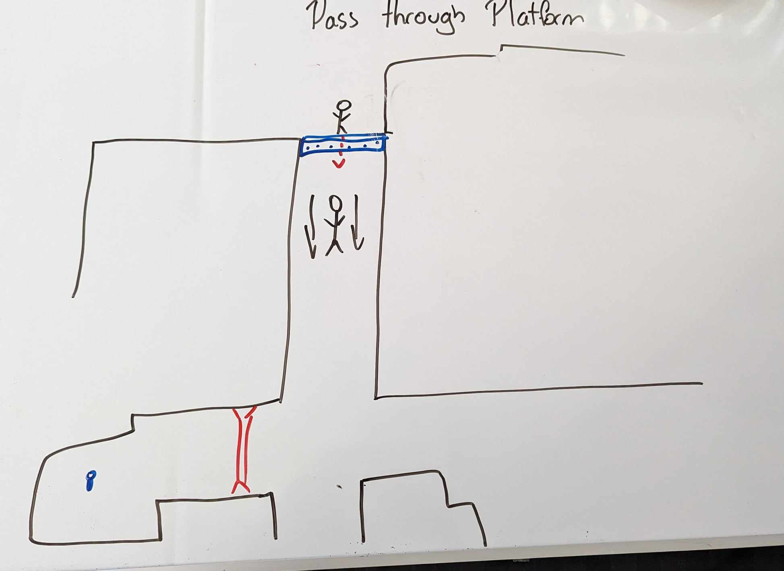

### 2.2. Keys/Weapon Pickup (Staff)
The player can spot the key but is unable to reach it due to a breakable wall. Dropping down allows them to attain the staff. The addition of the breakable wall was added to force the player to interact with it, demonstrating the potential for destroying those type of walls. The player now understands how to access the key.

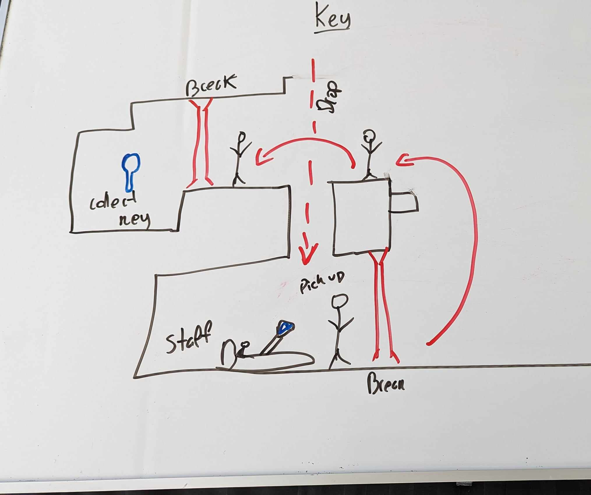

### 2.3. Checkpoints/Acid
Checkpoints determine the player's respawn point in case of death. A checkpoint was placed before the player confronted their first hazardous obstacle, acid, as it is likely that the player will mess up in their first attempt. 
This checkpoint alleviates the frustration of restarting from the beginning.
The introduction of acid as the first hazardous obstacle is the best way to test the newly developed movement skills the player acquired with a higher level of risk. 

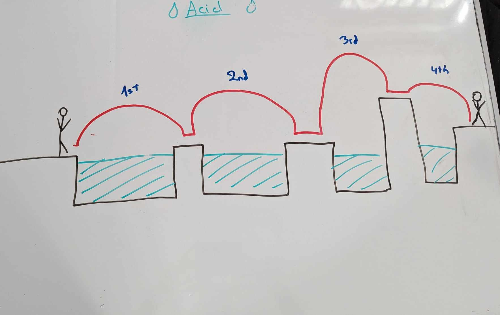
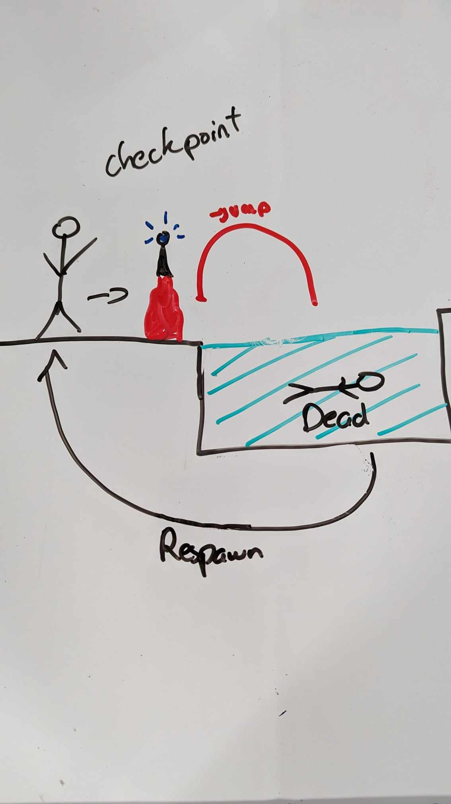

### 2.4. Health Pickups
A health pickup can be found right across the first acid obstacle. Considering that players may encounter difficulties with their initial hazardous obstacle, placing the health pack after it specially in a place they can’t  easily avoid will force the player to understand this item’s purpose. 

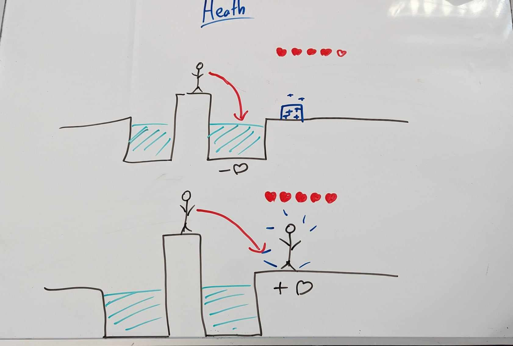

### 2.5. Moving Platforms
The first moving platform is introduced as the only way forward. The goal of this location is to not confuse the player on where to go. 

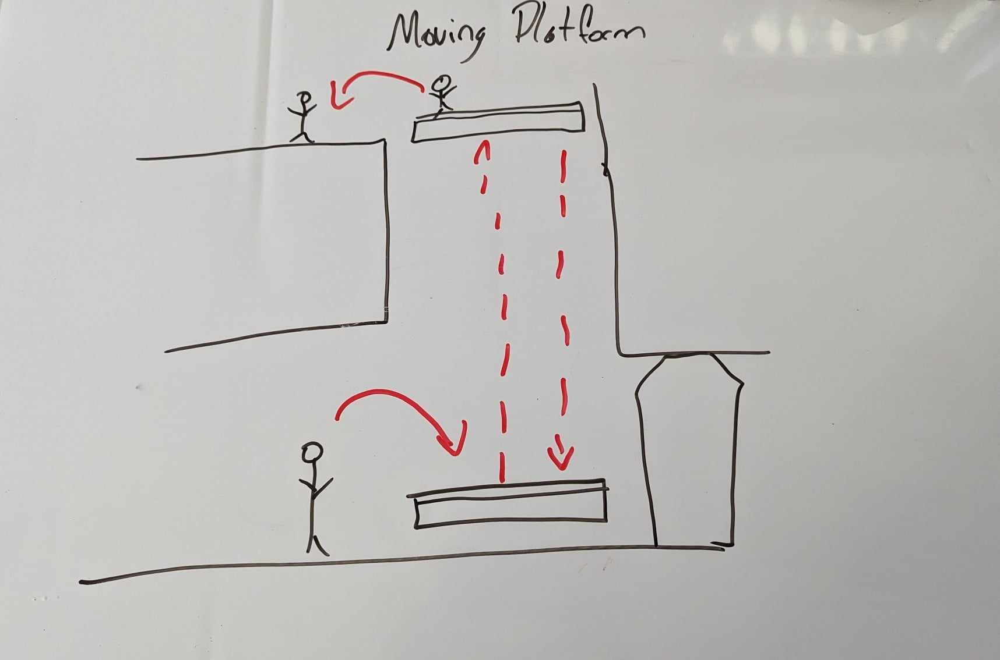

### 2.6. Spikes
Since the player becomes aware of potential hazards in the game world before encountering the first set of spikes, it's reasonable to expect them to be cautious.
Due to this, the spikes were placed on a moving platform where they are forced to jump over while in motion. This setup serves to test a new mechanic involving jumping while on a moving floor. The spikes help increase the tension as the player discovered their way through. 

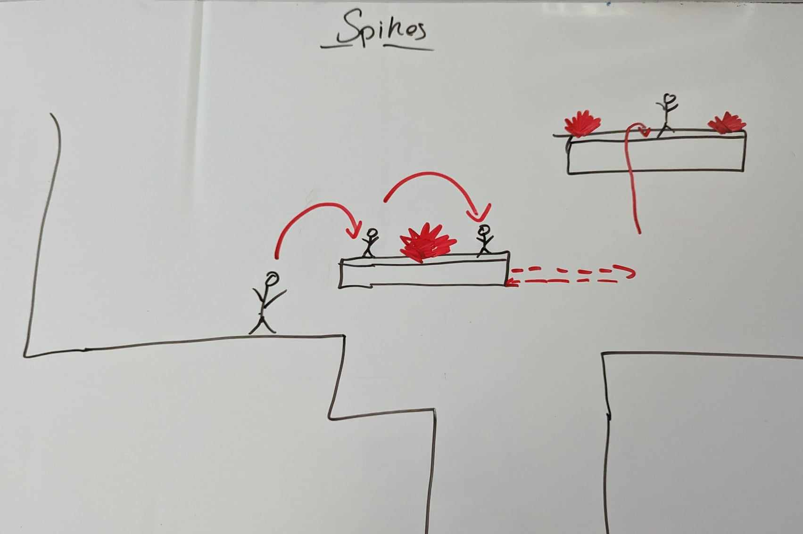

### 2.7. Chompers
Chompers can be found patrolling a moving platform. They were placed in a way the player can see from under them and choose when to approach them. Since this is the player's first encounter with a chomper their field of view is restricted. 

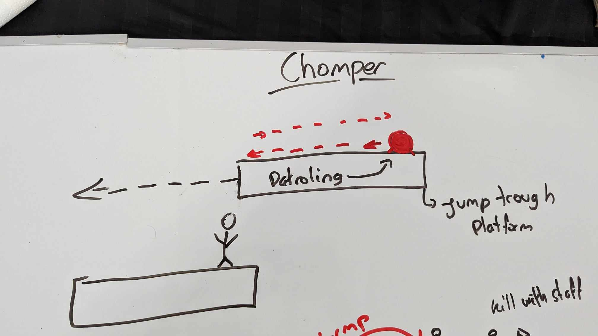

### 2.8. Spitters/Weapon Pickup (Gun)
A spitter is located at the centre of the room in order to increase the puzzle's difficulty. The goal of the player is to obtain the gun and activate the switches. They face the choice of either risking a life by confronting the spitter with the staff or taking a safer approach to acquire the gun while evading damage. 

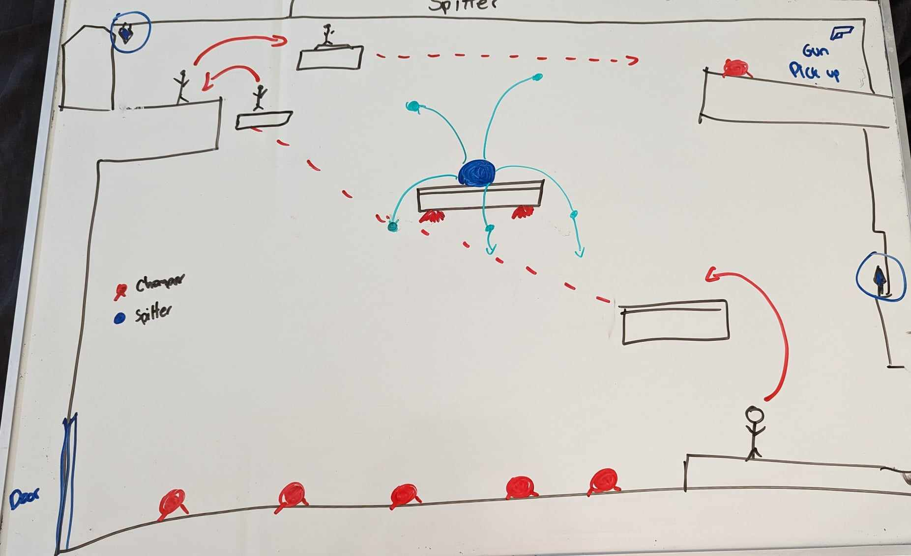

## 3. Spatiotemporal Design

### 3.2. Level Map – Section 1
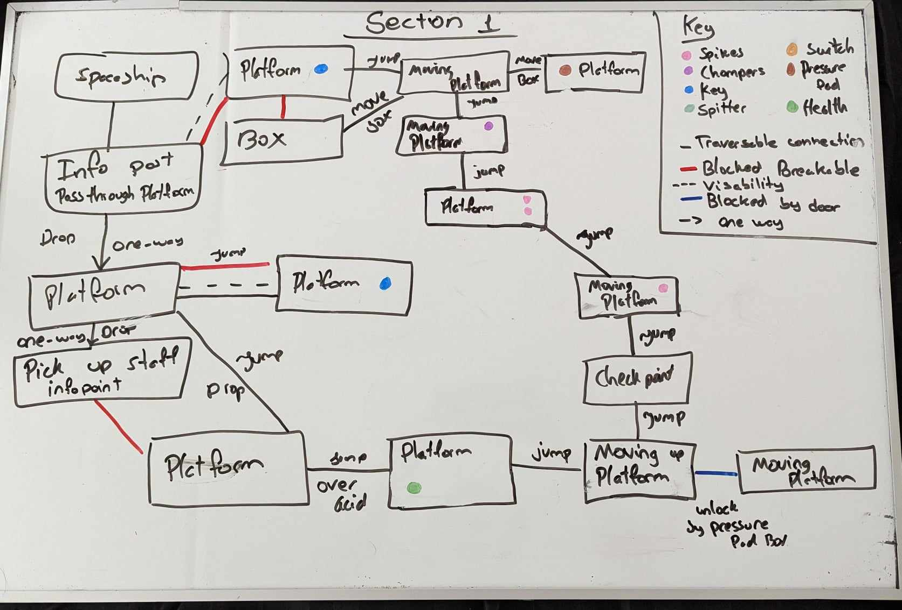
### 3.3.	Level Map – Section 2
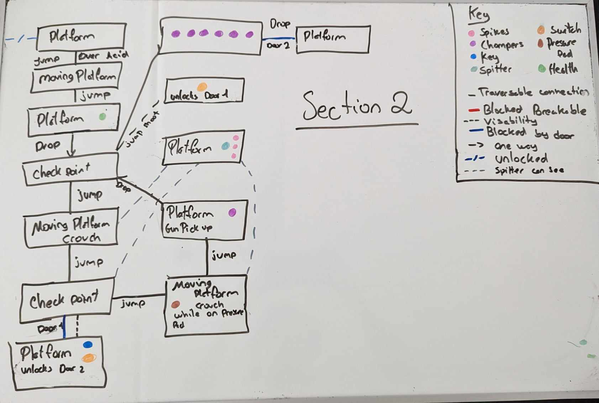
### 3.4.	Level Map – Section 3
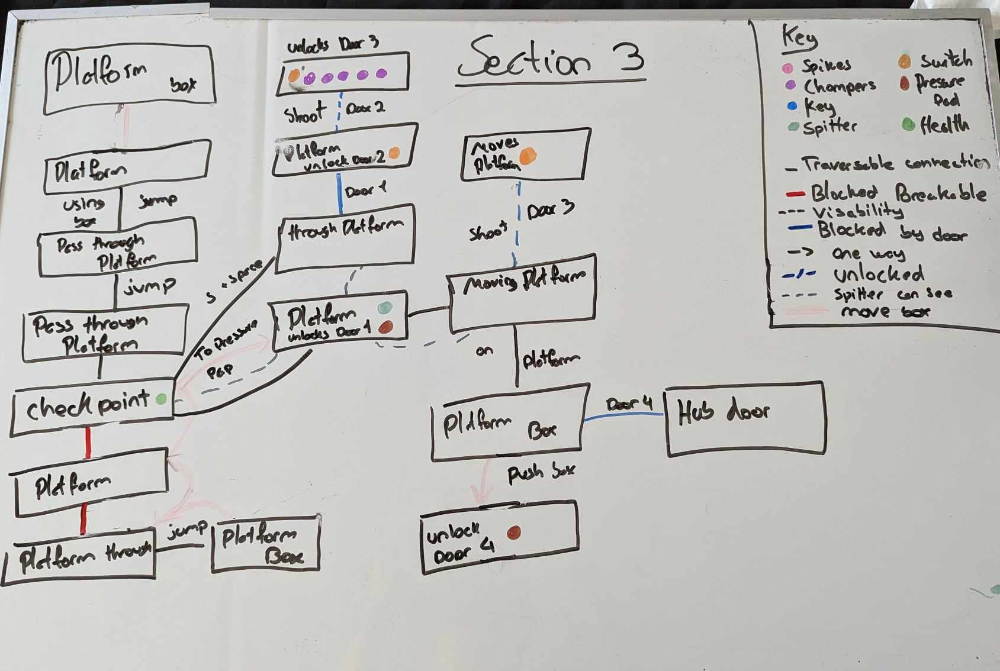

## 4. Iterative Design (~400 words)
Using iterative design helped understand the limitations of the kit as well as finding effective and ineffective puzzle designs. Image 1 was the first piece of iterative work done for the assignment. The goal is to withhold the first key, requiring players to earn it through effort while teaching them basic mechanics. Originally, players were intended to fall directly into the staff room and navigate their way out. But it was quickly changed to give the player the choice to fall into the staff room. Only by testing was it realised that the player could not make their way back up to get the key, to fix this, a small ledge was incorporated to facilitate access back up. When the player first comes into contact with acid lakes they were set at an even distance to make sure it would remain an easy task. Upon repeated playtesting it was observed that having that many repeated jumps was dull. Consequently, one of the ledges was raised to maintain a challenging experience for the player and ensure their learning curve continued to rise.
The second image was sketched during a class, the idea came up and had to be noted down. Once tested at home, several issues surfaced. The chompers were frequently getting stuck on the breakable wall. To resolve this, the wall was replaced with a door operable by a nearby switch. However, a new problem was found, the chompers kept triggering the switch by walking over it.  To fix this, a small dent was added to the ground which made sure they would not come in contact with the switch. By testing various iterations of these and other ideas, I was able to quickly identify flaws and either correct them or discard the concepts altogether. A different concept that became challenging was attempting to use the acid lake as a waterfall in the third key room. Despite many different attempts to implement this idea, it resulted in various bugs, such as unintended water sounds playing and a far too wide damage hitbox. Despite different attempts to correct these issues such as adjusting the size, location, and setting, the acid would not work in the way intended. Ultimately, this idea had to be discarded.
Upon drawing level maps it was noticed that two checkpoints were positioned too close together, while the number of health packs available was far too low.
Overall Iterative design was the most helpful tool in this level design. The ability to quickly sketch and test ideas was dire in reducing mistakes within the game. Testing multiple times also ensures the toy is fun and if not then alternative ideas can be explored until the most effective ones are found and implemented. 

